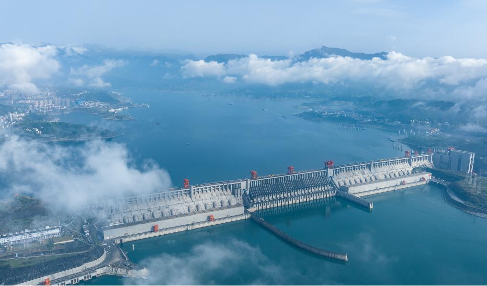
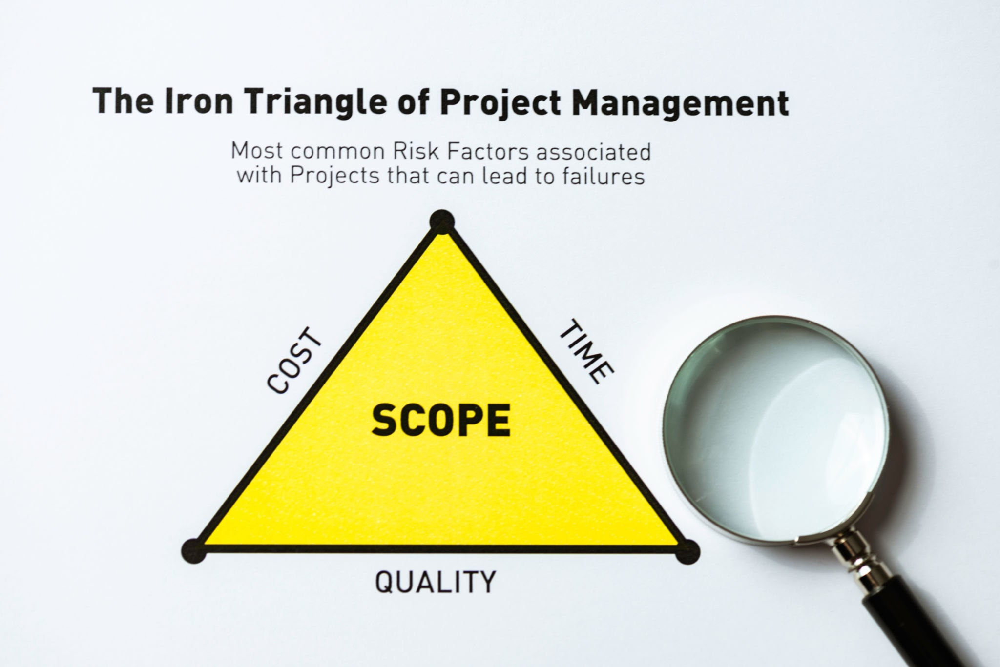
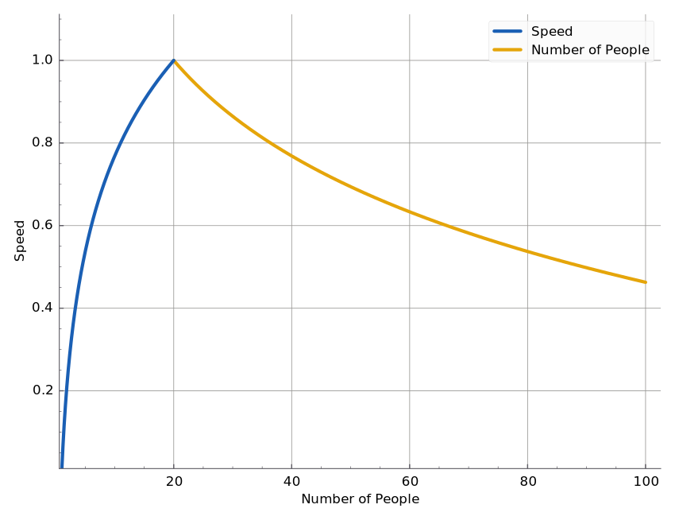
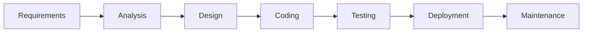
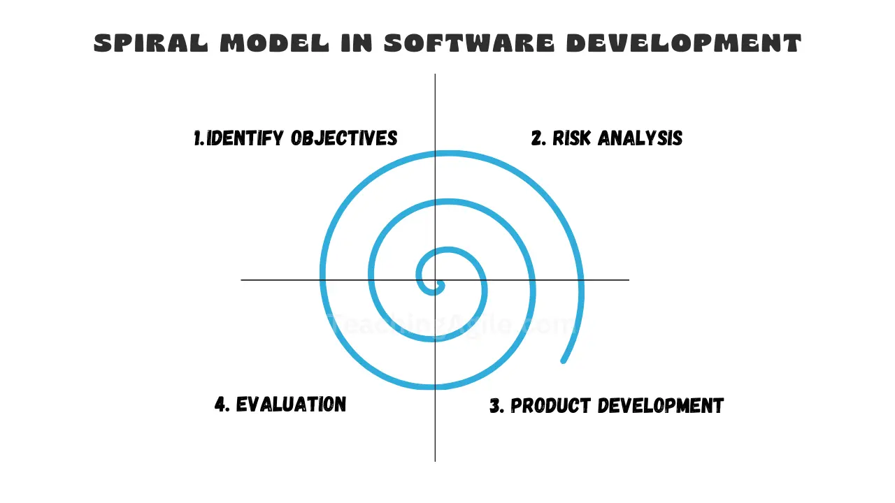
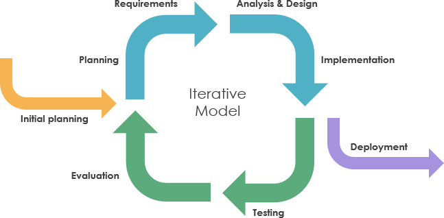
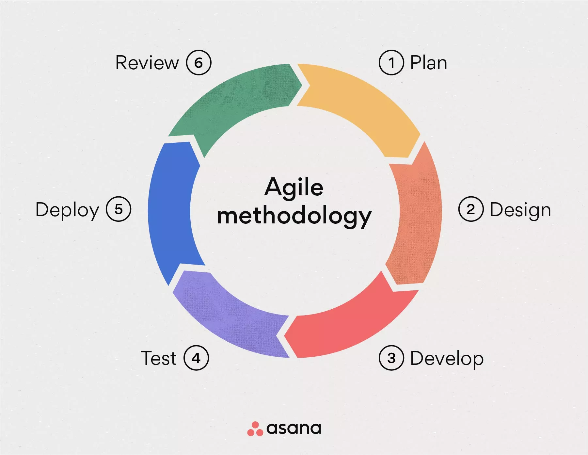

# إدارة المشاريع
## المحاضرة 1
### مقدمة
**2025-2026**
---

```yaml
hideInToc: true
```
# جدول المحتويات
<toc/>

---

# المشروع
## ما هو المشروع
- يُعرَّف المشروع بأنه نشاط مؤقت لإنشاء منتج أو خدمة أو نتيجة متميزة.
- يجب أن يكون للمشروع منتج أو خدمة أو نتيجة متميزة (هدف المشروع).
- للوصول إلى الهدف، نحتاج إلى نتائج محددة بوضوح، وبعبارة أخرى، نحتاج إلى تحديد المنتج أو الخدمة أو النتيجة النهائية التي نهدف إلى الحصول عليها من المشروع.
- يُعد هذا الجزء الأهم في المشروع، لأنه يحدد كيفية قياس هدف المشروع وتقرير نجاحه أو فشله.

---

```yaml
hideInToc: true
```
# المشروع
## ما هو المشروع
- يحدد نوع هدف المشروع الكيفية التي نحتاج إلى إدارة المشروع بها.
	- إذا كان هدف المشروع هو منتج، فيجب أن يكون لدينا منتج يلبي المواصفات التي يقدمها العملاء.
	- إذا كنا نعمل في القطاع الإنساني، فالهدف يختلف؛ فهو لم يعد منتجًا أو ربحًا، بل بعدد الأشخاص أو العائلات التي استطعنا مساعدتهم.
		- على سبيل المثال، خدمة قانونية تساعد الأشخاص في اجتياز تعقيدات وثائق الزواج وشهادات الميلاد وإجراءات الطلاق، تُقاس بعدد الأفراد المساعدين.
		- عندما نقدم مساعدات إغاثية للنازحين داخليًا (IDP)، فغالبًا ما تُقاس بعدد العائلات.
- في سياق المقرر الدراسي بأكمله، تشير كلمة "المنظمة" إلى أي شركة عامة أو خاصة أو مساهمة عامة، أو هيئة حكومية، أو منظمة غير حكومية (NGO)، أو منظمة غير ربحية، أو أي نوع آخر من الكيانات التنظيمية التي تعمل في مشروع أو تستفيد منه.
---

# مكونات المشروع
- يتكون المشروع مما يلي
	1. الهدف
	2. الموارد
	3. أصحاب المصلحة
	4. العملاء / الزبائن
---

```yaml
hideInToc: true
```
# مكونات المشروع
## الهدف
- لنستطيع القول إننا نعمل على مشروع، نحتاج إلى أن يكون لدينا هدف نستهدفه.
- يمكن أن يكون الهدف:
	1. منتج فريد كليًا أو جزئيًا (مثل محرك جديد لسيارة جديدة)
	2. خدمة فريدة أو القدرة على تقديم خدمة فريدة
	3. أطروحة ماجستير / دكتوراه أو براءة اختراع
	4. مزيج مما سبق
---

```yaml
hideInToc: true
```
# مكونات المشروع
## الموارد
- للعمل على المشروع، نحتاج إلى مجموعة من الموارد:
	1. الموارد المالية (الميزانية والأموال)
	2. المواد المتخصصة
	3. الأشخاص
	4. الجدول الزمني لتنفيذ المشروع
---

```yaml
hideInToc: true
```
# مكونات المشروع
## الموارد
1. الموارد المالية:
	- تمثل الميزانية التكلفة المتوقعة للمشروع.
	- أما التكلفة فهي الأموال الفعلية التي تُنفق على المشروع.
	- نحتاج إلى جعل التكلفة قريبة قدر الإمكان من الميزانية.
		- العلاقة بين التكلفة والميزانية تنقسم إلى ثلاثة أنواع:
			- توازن الميزانية: التكلفة = الميزانية
			- فائض الميزانية: التكلفة < الميزانية
			- عجز الميزانية: التكلفة > الميزانية
			- يُعد الفائض هو أفضل سيناريو ممكن، بينما العجز هو أسوأ سيناريو، أما التوازن فيُعد هو الحال المعتاد.
---

```yaml
hideInToc: true
```

# مكونات المشروع
### الموارد
1. الموارد المالية:
	- لماذا قد نقع في عجز في الميزانية؟
		- ضعف التخطيط وعدم أخذ جميع المصاريف المتوقعة الممكنة في الاعتبار عند وضع الميزانية.
		- تغير في أسعار المواد قبل شرائها والحصول عليها.
		- تغير كبير في المناخ الاقتصادي أثناء التنفيذ (ارتفاع أو انخفاض سعر صرف العملات الأجنبية / الذهب، أو تغير في القوانين في المنطقة التي ننفذ فيها المشروع مما يسبب مصاريف إضافية جديدة، أو عقوبات اقتصادية).
		- الحوادث أثناء التنفيذ، مثل الإصابات الجسدية بسبب نقص إجراءات السلامة مما يؤدي إلى دفع تعويضات مالية كبيرة.
		- التغيرات غير المتوقعة الناتجة عن اكتشافات جديدة أثناء التنفيذ.
		- عمليات التفتيش التي تشير إلى عدم الامتثال لمعايير السلامة أو المواصفات مما يضطر إلى إعادة تنفيذ جزء من المشروع.
---

```yaml
hideInToc: true
```
# مكونات المشروع
## الموارد
1. الموارد المالية: أمثلة على مشاريع تعرضت لعجز في الميزانية:
	1. **نفق المانش (The Channel Tunnel):**
		- نفق تحت الماء يربط إنجلترا بفرنسا ويسر مرور القطارات.
		- كانت الميزانية الأولية 5.5 مليار جنيه إسترليني، لكن التكلفة الفعلية بلغت 9.5 مليار جنيه إسترليني.
		- نتج العجز عن نوع غير متوقع من التربة كانوا يحفرون فيها من الناحية الجيولوجية.
	2. **أولمبياد كندا 1976:**
		- كانت ميزانية المشروع 300 مليون دولار كندي، وبلغت التكلفة 1.5 مليار دولار كندي.
		- كان التكلفة الأساسية للملعب، حيث كلف حوالي 700 مليون دولار كندي بسبب إضرابات العمال وارتفاع أسعار المواد وسوء الأحلام الجوية.
---

```yaml
hideInToc: true
```
# مكونات المشروع
## الموارد
1. الموارد المالية: أمثلة على مشاريع تعرضت لعجز في الميزانية:

	3. برنامج طائرة F-35 لايتنينج (F-35 Lighting):
		 - الجوهرة في تاج القوات الجوية الأمريكية.
		- صُممت كبديل عن طائرة F-22 رابتور القديمة.
		- تضمنت العديد من عناصر التصميم الفريدة، مثل المحرك الواحد (كانت لدى F-22 محركان) وبعض الإصدارات تدعم الإقلاع والهبوط العمودي (VTOL).
		- طُورت عدة إصدارات (للقوات الجوية، والقوات الجوية البحرية، ومشاة البحرية).
		- بلغت التكلفة 1.7 تريليون دولار (عجز بنسبة 88%) وتأخرت 10 سنوات عن موعدها.
		- يرتبط ذلك في الغالب بكيفية موافقة الولايات المتحدة وتمويلها لعقود الدفاع.

*هذا ليس ضمن نطاق المقرر، ومع ذلك، فقد وجد مصنعو الأسلحة ومقاولو الدفاع في الولايات المتحدة نظامًا يجب بموجبه على حكومة الولايات المتحدة تمويل مشروع الدفاع رغم تجاوزه الميزانية (العجز) وتجاوزه الزمني.*

---

```yaml
hideInToc: true
```
# مكونات المشروع
## الموارد
2. المواد:
	- مجموعة من المواد المطلوبة لتحقيق الهدف، على سبيل المثال:
		1. مواد البناء (الأسمنت، الطوب، الخرسانة الخلوية... إلخ)
		2. لوحات التبديل الكهربائي
		3. الخوادم (Servers)
		4. البنية التحتية للشبكات، وأنظمة المراقبة والإنذار
		5. الأثاث
	- غالبًا ما تتقلب أسعار المواد أثناء التنفيذ نتيجة للتغيرات في الظروف الاقتصادية، أو المناخ السياسي، أو حتى التشريعات.
		- على سبيل المثال، الرسوم الجمركية التي فرضها رئيس الولايات المتحدة على مواد مستوردة متنوعة تسببت في تحولات كبيرة في المشاريع الجارية من حيث تكلفة المواد وتوفرها في السوق.
---

```yaml
hideInToc: true
```
# مكونات المشروع
## الموارد
2. المواد:
	- أحد أكبر التحديات هو ضمان توفر المواد داخل السوق المحلي؛ وإلا فسنضطر إلى الاستيراد من الأسواق الخارجية. وهذا يمكن أن يرفع التكاليف، حيث أن تكلفة الوحدة عند استيراد عنصر واحد أعلى بكثير من الاستيراد بكميات كبيرة.
---

```yaml
hideInToc: true
```
# المشروع
## مكونات المشروع
## الموارد
3. الأشخاص:
	- هم الأشخاص الذين يقومون بتنفيذ المشروع لتحقيق الهدف.
	- بشكل عام، وجود أكثر من شخص واحد في نفس المكان سيؤدي إلى نشوء نزاعات.
	- ونتيجة لذلك، تتمثل إحدى الواجبات الرئيسية لمدير المشروع في حل النزاعات بين الأفراد.
		- أحيانًا يسير كل شيء على ما يرام ويستمر الأشخاص في العمل معًا.
		- وأحيانًا تحتاج إلى تغيير تكوين الفرق للتأكد من أن الأفراد الذين توجد بينهم نزاعات لا يتفاعلون مع بعضهم البعض.
		- وأحيانًا تضطر إلى فصل أحد الموظفين.
---

```yaml
hideInToc: true
```
# مكونات المشروع
## الموارد
3. الأشخاص:
	- من المتطلبات الرئيسية لمدير المشروع أن يقسم المهام على الأفراد بناءً على خبرتهم ومعرفتهم.
		- لا يمكنك إسناد مهام هندسة مدنية إلى مختص تكنولوجيا المعلومات (التعليم مختلف).
		- الطبيب لا يمكنه القيام بنفس الأعمال التي يقوم بها المزارع (الخبرة مختلفة).
		- باختصار، عند تقسيم المهام بين الأفراد، يجب أن نضع في اعتبارنا معرفتهم، وتعليمهم، وخبرتهم.
---

```yaml
hideInToc: true
```
# مكونات المشروع
## الموارد
4. الجدول الزمني:
	- لكل مشروع حد زمني.
	- أي أن تاريخ بدء وتاريخ انتهاء.
	- وبالتالي، نحتاج إلى إنشاء جدول يوضح المهام المختلفة للمشروع والحد الزمني لكل مهمة للوصول إلى تاريخ الانتهاء.
	- عادة ما يوجد بند مسؤولية في عقد المشروع بخصوص وقت التنفيذ:
		- ضمان منح مكافآت في حالة الانتهاء ضمن المواصفات قبل تاريخ الانتهاء.
		- فرض عقوبات مالية في حالة الانتهاء بعد تاريخ الانتهاء أو خارج المواصفات المطلوبة.
---

```yaml
hideInToc: true
```
# مكونات المشروع
## الموارد

<div grid="~ cols-2 gap-4">
<div>

4. الجدول الزمني
	- إن الوقت المحدد لتنفيذ المشروع لا يعني أنه قصير.
	- قد يستغرق إنجاز المشروع سنوات، مثل أكبر سد في العالم على نهر اليانغتسي في الصين، سد البوابات الثلاث (The 3 Gorges Dam).
	- هذا هو أكبر سد في العالم، بدأ البناء فيه عام 1994 وانتهى عام 2012 بطول جسد يبلغ 2.3 كيلومتر.
	- وفي عام 2015 تم زيادة ارتفاع السد لأنه يخزن كمية من المياه أكبر من المتوقع.
</div>
<div>



*ملاحظة: هذا السد يحتوي على مصعد للسفن !*
</div>
</div>
---

```yaml
hideInToc: true
```
# مكونات المشروع
## الموارد
4. الجدول الزمني:
	- نقول إننا أنهينا المشروع في الحالات التالية:
		1. تحقق الهدف: استطعنا إنشاء المنتج / تقديم الخدمة / النتيجة المطلوبة.
		2. عدم قابلية تحقيق الهدف: مع تقدم التنفيذ، ندرك أن هدف المشروع لا يمكن تحقيقه لعدة أسباب متنوعة، مثل ما حدث للهند عندما حاولت المنافسة مع تايوان في التسعينيات في تصنيع الرقائق ولكنها فشلت.
		3. عدم وجود الحاجة للمشروع بعد الآن: بطريقة أو بأخرى، لم يعد السبب الذي أدى إلى وجود المشروع موجودًا.
		4. انتهاء الالتزام المالي: لا يوجد المزيد من الأموال.
		5. عدم توفر الموارد البشرية و/أو المادية: وهذا ما يحدث حاليًا لشركة TSMC، حيث يحاولون بناء مصانع جديدة لتصنيع الرقائق في الولايات المتحدة، وواجهوا نقصًا في المهندسين المهرة والذين لديهم الخبرة لإدارة هذه المنشآت مما أدى إلى تأجيل موعد الافتتاح من 2024 إلى 2025 للمصنع الأول، وإلى 2027 أو 2028 للمصنع الثاني.
---

```yaml
hideInToc: true
```
# مكونات المشروع
## الموارد
4. الجدول الزمني:
	- نقول إننا أنهينا المشروع في الحالات التالية:

		6. أسباب قانونية: التعدي على قطعة أرض أخرى، أو انتهاك براءة اختراع أو القوانين القائمة.
	- الأسباب الثلاثة الأخيرة قد تتسبب في توقف المشروع تمامًا أو مؤقتًا:
		- يمكننا تأمين مصدر تمويل جديد، أو حل المشكلات القانونية، أو توفير مصادر جديدة للمواد وتعيين عمال مهرة جدد، ولكن مع عبء مالي كبير.
		- معالجة المشاكل ستتسبب بتأخر إيرادات المشروع، كما أن حل المشكلات القانونية قد يتطلب دفع غرامات وتسويات مالية.
		- قد تكون المصادر الجديدة للمواد أكثر تكلفة، والتعيينات الجديدة أكثر تكلفة من التعيينات القديمة.
---

```yaml
hideInToc: true
```
# مكونات المشروع
## أصحاب المصلحة
<div grid="~ cols-2 gap-4">
<div>

- من هم أصحاب المصلحة Stakeholders ؟
	- هم الأفراد أو المجموعات أو المنظمات المهتمة بهدف المشروع، وقد يكونون عملاء، لكنها بشكل عام أوسع نطاقًا من ذلك.

</div>
<div>

</div>
</div>
---

```yaml
hideInToc: true
```
# مكونات المشروع
## أصحاب المصلحة
<div grid="~ cols-2 gap-4">
<div>

- من هم أصحاب المصلحة؟
	- لنأخذ مثالًا لفهم من هم أصحاب المصلحة:
		- إذا كنت شركة مساهمة مغفلة فإن أصحاب المصلحة في هذه الحالة هم المساهمون ممثلين في مجلس الإدارة.
		- إذا كنت شركة عامة ممولة من الحكومة، فإن أصحاب المصلحة هم دافعو الضرائب، وهم في نفس الوقت العملاء.
		- إذا كنت منظمة غير حكومية تعمل في القطاع الإنساني، فإن المستفيدين (benefactors) هم أصحاب المصلحة.
</div>
<div>

</div>
</div>
---

```yaml
hideInToc: true
```
# مكونات المشروع
## أصحاب المصلحة
<div grid="~ cols-2 gap-4">
<div>

- تختلف اهتماماتهم لتشمل الجوانب المالية والاجتماعية والتنظيمية. ويمكن لمشاركتهم التأثير على نجاح المشروع أو يتأثرون به.
- في سياق مشروع برمجي، قد يشمل أصحاب المصلحة:
	- العملاء
	- الموظفون
	- المستثمرون (الممولون)
	- الهيئات التنظيمية
	- المستخدمون النهائيون للبرمجيات
</div>
<div>

</div>
</div>
---

```yaml
hideInToc: true
```
# مكونات المشروع
## العملاء / الزبائن
- من هم العملاء؟
	- التعريف: العملاء هم الأفراد أو المنظمات التي تشتري أو تستخدم منتجًا أو خدمة معينة.
	- العلاقة: على عكس "الزبون" العشوائي الذي قد يقوم بصفقة لمرة واحدة، فإن العميل عادة ما تكون له علاقة مباشرة ومستمرة مع مقدم الخدمة أو الشركة. وغالبًا ما يتضمن ذلك عقدًا أو شراكة مهنية.
---

```yaml
hideInToc: true
```
# مكونات المشروع
## العملاء / الزبائن
- **العملاء / الزبائن مقابل أصحاب المصلحة**

| **الميزة**         | **العملاء**                                                                      | **أصحاب المصلحة**                                                                      |
| ------------------ | -------------------------------------------------------------------------------- | -------------------------------------------------------------------------------------- |
| **النطاق**         | مجموعة فرعية محددة تركز حصرًا على المنتج أو الخدمة.                               | المصطلح الشامل لكل من لديه مصلحة في نتيجة المشروع.                                    |
| **التركيز الرئيسي**| جودة وفائدة وقيمة المنتج النهائي الذي سيسلمه.                                    | غالبًا ما يتمحور حول العائدات المالية أو العائد على الاستثمار (ROI) أو المحاذاة الاستراتيجية. |
| **العلاقة**        | عادةً شراكة مبنية على المعاملة أو التبادل.                                        | مستويات متفاوتة من التأثير والمشاركة (من مستثمرين سلبيين إلى مستخدمين فاعلين).       |
| **الاهتمامات**     | مدفوعة بالرضا وحل المشكلات.                                                      | غالبًا ما يكون لديهم اهتمامات متنوعة — وأحيانًا متضاربة.                                |

---

# نتائج المشروع
- يجب أن ينتج عن أي مشروع نتائج ملموسة وغير ملموسة متنوعة.
- النتائج الملموسة:
	- الربح المالي
	- أسهم للمساهمين (أصحاب المصلحة)
	- أدوات جديدة
	- حصة في السوق
- النتائج غير الملموسة:
	- سمعة طيبة
	- نشر العلامة التجارية
	- فائدة عامة
---

# إدارة المشاريع
## التعريف
<div grid="~ cols-2 gap-4">
<div>

- **التعريف الأول:** إدارة المشاريع هي تطبيق المعرفة والمهارات والأدوات والتقنيات على أنشطة المشروع لاستيفاء متطلبات وأهداف المشروع.
- **التعريف الثاني:** يمكن تعريفها أيضًا بأنها إدارة الموارد المتنوعة المستخدمة في إنجاز مشروع محدد لتحقيق النتائج المرجوة في أقصر وقت ممكن وبأقل تكلفة ممكنة مع أعلى جودة ممكنة. أي تغير في أحد جوانب المثلث سيؤثر على الأجزاء الأخرى.
</div>
<div>

</div>
</div>
---


```yaml
hideInToc: true
```
# إدارة المشاريع
## التعريف
- تمكّن إدارة المشاريع الناجحة الأفراد والمجموعات والمنظمات من:
<div grid="~ cols-2 gap-4">
<div>

1. تحقيق الأهداف التجارية
2. تلبية توقعات أصحاب المصلحة
3. زيادة القدرة على التنبؤ بالنتائج
4. تعزيز فرص النجاح
5. تسليم المنتج الصحيح في الوقت الصحيح
6. حل المشكلات بفعالية
</div>
<div>

7. الاستجابة للمخاطر في الوقت المناسب
8. تحسين استثمار الموارد التنظيمية
9. تحديد أو معالجة أو إنهاء المشاريع الفاشلة
10. إدارة القيود وموازنة تأثيراتها المتنوعة
11. إدارة التغيرات في الوقت المناسب
</div>
</div>
---


```yaml
hideInToc: true
```
# إدارة المشاريع
## التعريف
- عواقب إدارة المشاريع الضعيفة:
	1. **تخطي المواعيد النهائية:** تجاوز القيود الزمنية وتواريخ التسليم.
	2. **تجاوز الميزانية:** زيادة غير منضبطة في التكاليف وصرف الموارد.
	3. **ضعف الجودة:** تسليم منتج به أخطاء أو غير موثوق أو لا يلبي المعايير.
	4. **إعادة العمل في المشروع:** الاضطرار إلى إعادة القيام بالعمل بسبب أخطاء أو غموض — وهو ما يُعد مدمرًا للإنتاجية.
	5. **زحف النطاق (Scope Creep):** توسع غير مخطط وغير منضبط لمتطلبات المشروع.
	6. **تضرر السمعة:** فقدان المصداقية للمنظمة أو الفريق.
	7. **استياء أصحاب المصلحة:** إحباط العملاء أو المستثمرين أو المستخدمين.
	8. **فشل الأهداف:** الفشل التام في تحقيق الأهداف الأصلية للمشروع.
---

# أهمية إدارة المشاريع
- تنبع أهمية إدارة المشاريع من أهمية المشاريع نفسها، حيث أن المشاريع هي الطريقة الأساسية التي يتم من خلالها توليد القيمة للمنظمة.
- في بيئة الأعمال المعاصرة، يجب على المدراء التعامل مع ميزانيات أصغر، وجداول زمنية أقصر، وموارد محدودة، وتغيرات تكنولوجية سريعة لتحقيق ربحية المنظمة.
- تتميز بيئة الأعمال بالديناميكية وسرعة التغير، مما يتطلب من الشركات تبني إدارة المشاريع لتحقيق إشراف تنظيمي فعال وتحقيق الأرباح.
- تسمح إدارة المشاريع الناجحة للمنظمة بما يلي:
    1. ربط نتائج المشروع بالأهداف التجارية للمنظمة.
    2. المنافسة بفعالية في السوق.
    3. ضمان استدامة المنظمة.
    4. الاستجابة للتغيرات في بيئة الأعمال من خلال تعديل خطط المشروع.
---

# دورة حياة المشروع
- هي سلسلة المراحل التي يمر بها المشروع من لحظة البدء حتى تحقيق أهدافه النهائية.
- هذه المراحل موجودة في حياة أي مشروع، بغض النظر عن منهجية التنفيذ المستخدمة (مثل الشلال أو أجايل).
- تشمل الخطوات التالية:
    1. **التهيئة (البدء):** في هذه المرحلة، يتم تحديد أهداف المشروع من خلال التواصل مع العميل وفهم احتياجاته المحددة.
    2. **التخطيط:** في هذه المرحلة، يتم وضع الجدول الزمني للمشروع وتقدير التكاليف وتحديد الأدوات المطلوبة للتنفيذ. وتُعتبر هذه المرحلة الأكثر أهمية في الإدارة لأن التنفيذ بأكمله يعتمد عليها.
    3. **التنفيذ:** في هذه المرحلة، يتم تنفيذ المشروع بالكامل وفقًا للجدول الزمني والميزانية الموضوعة.
    4. **الإغلاق (الختام):** يتم الانتهاء من المشروع وإجراء اختبارات الجودة وتسليم المنتج النهائي للعميل.
---

# دورة حياة المشروع
<div class="text-center">


</div>
---

# مدير المشروع
- **التعريف الرسمي:** مدير المشروع هو الفرد المسؤول عن تطبيق منهجية إدارة المشاريع على مشروع ما لتحقيق نتائجه ضمن الموارد والقيود المتاحة.
- **التعريف غير الرسمي:** شخص مقتنع تمامًا بأن تسعة نساء يستطيعن إنجاب طفل كامل النمو في شهر واحد فقط.
	- هذا التعريف غير الرسمي مشتق من آلية هامة جدًا: **إدارة الموارد**. يجب على مدير المشروع إدارة الموارد المتاحة (المواد / الأموال، الأشخاص، الوقت) لإكمال المشروع ضمن القيود المفروضة (الجودة والتكلفة والوقت) بطريقة ترضي أصحاب المصلحة والعميل على حد سواء.
	- ونتيجة لذلك، أصبح من "الممارسة الشائعة" زيادة عدد الأفراد العاملين في مشروع ما لتسريع التنفيذ.
	- ومع ذلك، تمامًا مثل الحمل البشري، فإن هذا لا يحقق دائمًا السرعة المرجوة.
---

```yaml
hideInToc: true
```
# مدير المشروع
<div grid="~ cols-2 gap-4">
<div>

- المهمة الأساسية للمدير هي إدارة الموارد بطريقة تضمن أفضل تنفيذ ممكن للمشروع.
- إذا كان تنفيذ المشروع بطيئًا وكان هناك فائض مالي، فقد يعمل المدير على إضافة المزيد من الأفراد إلى الفريق.
- وبطبيعة الحال، لهذه الزيادة حدودًا؛ فبعد عتبة معينة من الأفراد الإضافيين، ينهار الأداء وتنخفض السرعة.
</div>
<div>

</div>
</div>
---

```yaml
hideInToc: true
```
# مدير المشروع
<div grid="~ cols-2 gap-4">
<div>

- السبب الرئيسي في هذا الانهيار في الأداء هو أن الغالبية العظمى من الوقت يتحول إلى إدارة الفرق وحل النزاعات بين الأفراد أو بين الإدارات، بدلًا من التركيز على التنفيذ وحل المشكلات المتعلقة بإنشاء المنتج أو الخدمة الجديدة.
</div>
<div>

</div>
</div>
---

```yaml
hideInToc: true
```
# مدير المشروع
<div grid="~ cols-2 gap-4">
<div>

- **نقطة الانهيار:** 
	- تختلف هذه العتبة من مشروع لآخر بناءً على حجم المشروع:
		- تطوير لعبة ضخمة مثل **Cyberpunk 2077** يمكنها أن تدعم وتتطلب عددًا كبيرًا من المبرمجين.
		- تطوير تطبيق بسيط، يعتمد على **WordPress**، لا يتطلب هذا العدد الكبير من الموظفين.
	- **دور المدير:** لذلك، تتمثل الوظيفة الأساسية لمدير المشروع في تجنب الوصول إلى نقطة الانهيار هذه، والحفاظ على أعلى مستوى ممكن من الأداء دون الوصول إلى المرحلة التي تبدأ السرعة فيها في الانخفاض.
</div>
<div>

</div>
</div>
---

```yaml
hideInToc: true
```
# مدير المشروع
- بشكل عام، بصفتك مدير مشروع، يجب عليك أن:
	- **تحليل فكرة المشروع** واستخراج الأهداف القابلة للتنفيذ منها.
	- **وضع جدول زمني للمشروع** (الخط الزمني) للتنفيذ.
	- **تطوير ميزانية المشروع.**
	- **إجراء دراسة جدوى اقتصادية** (تحديد ما إذا كان الإنفاق المالي مبررًا وقابلًا للاسترداد).
	- **مراقبة وتتبع التنفيذ.**
	- **حل النزاعات** التي تنشأ بين أعضاء الفريق وأصحاب المصلحة والعملاء.
	- **معالجة النقص** في المواد أو العمالة باستخدام أفضل الطرق المتاحة.
إدارة المشاريع مرتبطة بشكل أساسي بمهاراتك الشخصية وقدرتك على التعامل مع الناس، وليست فقط بالتقنيات والأدوات التي نستخدمها.
---

# العلاقة مع تطوير البرمجيات
## نماذج التطوير
- في هندسة البرمجيات، لدينا عدة نماذج لتطوير البرمجيات:
	- الشلال (Waterfall)
	- الحلزوني (Spiral)
	- التكراري (Iterative)
	- الرشيق (Agile)
- تمثل هذه النماذج دورة حياة المشروع، وهي **ليست** إدارة مشاريع، بل هي **جزء** من إدارة المشاريع.
---

```yaml
hideInToc: true
```
# العلاقة مع تطوير البرمجيات
## نماذج التطوير
- نموذج الشلال (Waterfall)

---

```yaml
hideInToc: true
```
# العلاقة مع تطوير البرمجيات
## نماذج التطوير
- نموذج الحلزوني (Spiral)

---

```yaml
hideInToc: true
```
# العلاقة مع تطوير البرمجيات
## نماذج التطوير
- نموذج التكراري (Iterative)

---

```yaml
hideInToc: true
```
# العلاقة مع تطوير البرمجيات
## نماذج التطوير
- نموذج أجايل (Agile)

---
# ماذا بعد؟
- سنتناول المفاهيم التالية:
	1. إدارة الوقت في المشروع
	2. وضع الميزانيات
	3. DevOps
		1. Git
		2. Docker
		3. CI/CD
		4. Agile
