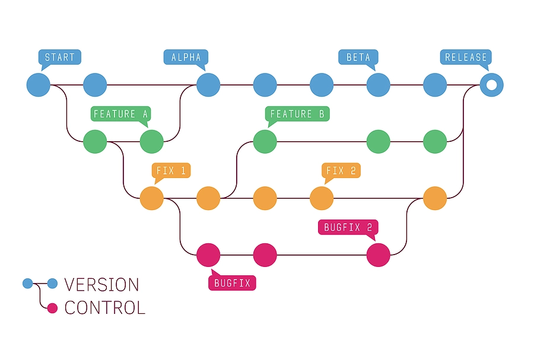
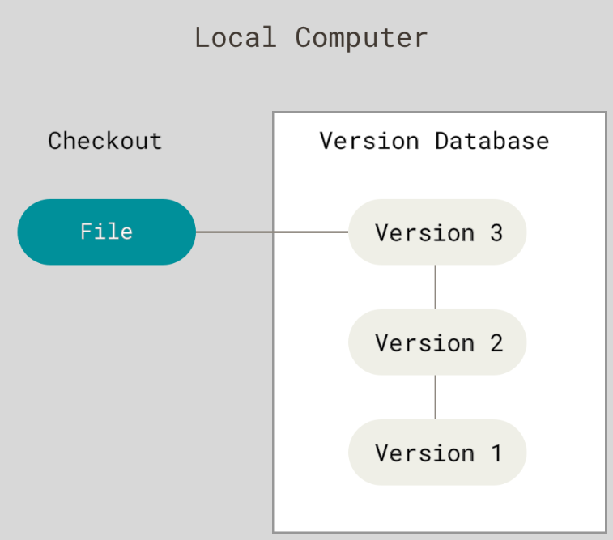
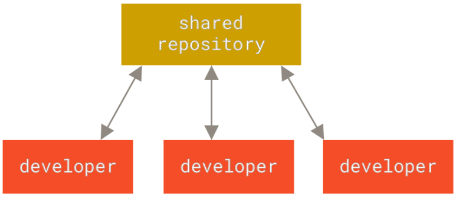
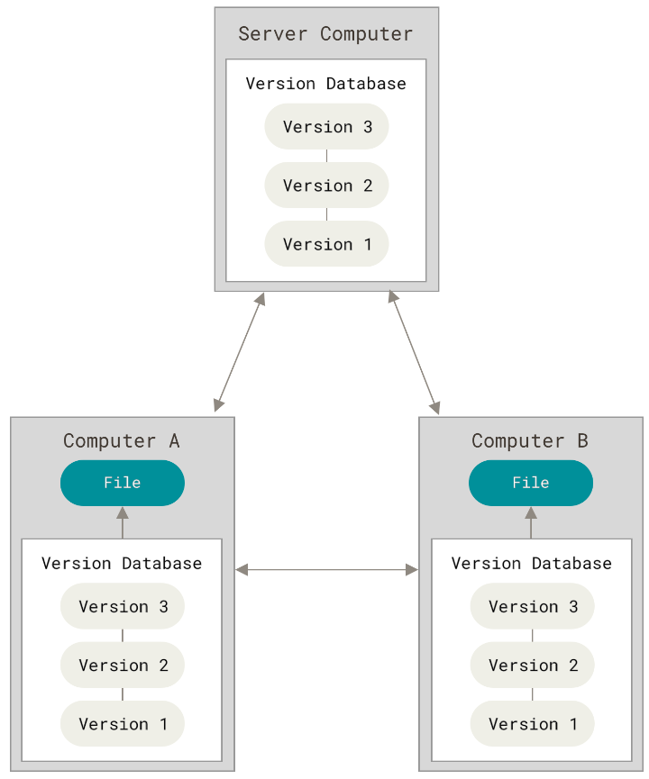
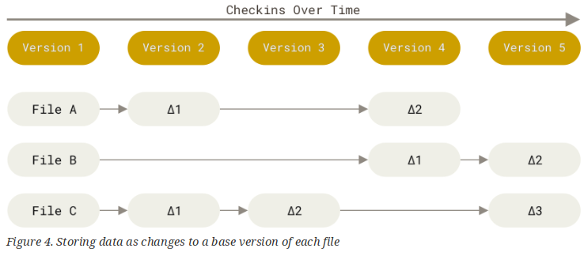
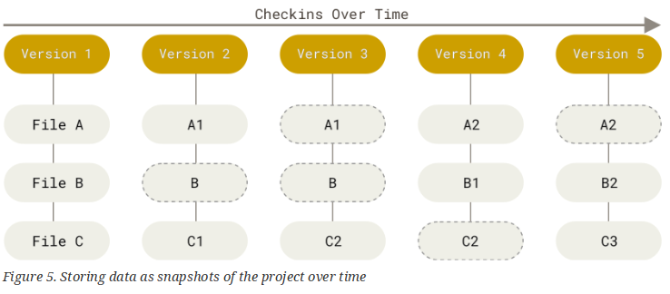
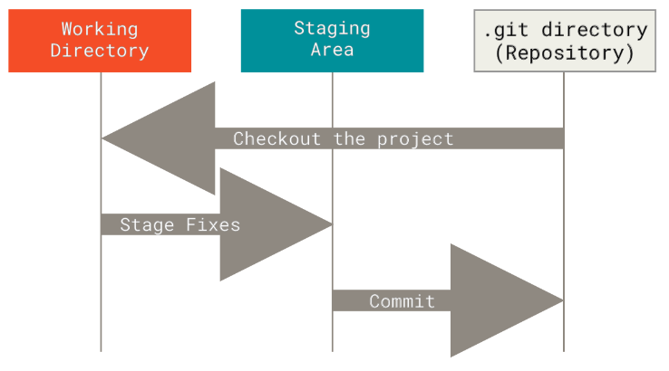

- <v-click at="1">أنت جالس في مكتبك، تعمل، تشاهد الميمز، وفوق كل ذلك تشاهد الأنمي الجديد الرائع المسمى Rooster Fighter عن ديك يقاتل الشياطين</v-click>
- <v-click at="2">وفجأة، تندلع البراكين، وتهتز الأرض، وغزو الفضائيون، وظهرت الشياطين من الجحيم، وعلاوة على ذلك فاز هاري ماجواير (مدافع مانشستر يونايتد) بجائزة الكرة الذهبية</v-click>
- <v-click at="3">"إن المصائب لا تأتي فرادى" هذا ما تقوله في قرارة نفسك</v-click>
- <v-click at="4">لذا تقوم بـ:</v-click>
	- <v-click at="5">git commit</v-click>
	- <v-click at="6">git push</v-click>
	- <v-click at="7">GET OUT</v-click>
	
---

```yaml
hideInToc: true
layout: cover
class: text-center
```

# إدارة المشاريع
## المحاضرة 2
### أنظمة التحكم في الإصدارات: Git
**2025-2026**
---

```yaml
hideInToc: true
```
# جدول المحتويات:
<toc />

---

# نظام التحكم في الإصدارات (VCS)
- نظام التحكم في الإصدارات هو نظام يسجل التغييرات التي تطرأ على ملف أو مجموعة ملفات على مدار الوقت بحيث يمكنك استدعاء إصدارات محددة لاحقًا.
- وبعبارة أخرى، تستخدمه لتتبع التغييرات التي تجريها على الملفات، ولإلغاء التغييرات، وللرجوع إلى حالة سابقة.
<div grid="~ cols-2 gap-1">
<div>

- إذا كنت مصمم رسومات أو مصمم ويب وتريد الاحتفاظ بكل إصدار من صورة أو تخطيط، فإن نظام التحكم في الإصدارات (VCS) هو شيء حكيم جدًا لاستخدامه.
- يسمح لك بإعادة ملفات محددة إلى حالة سابقة.
- أو إعادة المشروع بأكمله إلى حالة سابقة.
- ومقارنة التغييرات على مدار الوقت، ومعرفة من قام آخر بتعديل شيء ما قد يكون سبب مشكلة، ومن قدم مشكلة ومتى (باستخدام أمر `git blame`) وغير ذلك الكثير.
</div>
<div>

</div>
</div>
---

```yaml
hideInToc: true
```
# نظام التحكم في الإصدارات
- أنواع أنظمة التحكم في الإصدارات (VCS):
	- محلي (Local)
	- مركزي (Centralized)
	- موزع (Decentralized / Distributed)
---

```yaml
hideInToc: true
```
# نظام التحكم في الإصدارات
<div grid="~ cols-2 gap-1">
<div>

- نظام التحكم في الإصدارات المحلي (Local VCS):
	- يحتوي النظام المحلي على قاعدة بيانات بسيطة تحتفظ بجميع التغييرات على الملفات ضمن سيطرة المراجعة.
	- كان أحد أشهر أدوات VCS نظامًا يسمى RCS، ولا يزال يوزع مع العديد من أجهزة الحاسوب اليوم.
	- يعمل RCS من خلال الاحتفاظ بمجموعات من التصحيحات (Patch Sets) — أي الفروقات بين الملفات — بتنسيق خاص على القرص.
	- ويمكنه بعد ذلك إعادة إنشاء شكل أي ملف في أي نقطة زمنية عن طريق تجميع كل التصحيحات معًا.
</div>
<div>

</div>
</div>
---

```yaml
hideInToc: true
```
# نظام التحكم في الإصدارات
<div grid="~ cols-2 gap-1">
<div>

- أنظمة التحكم المركزية في الإصدارات (CVCS)
	- للتعاون مع المطورين على أنظمة أخرى، تم تطوير أنظمة التحكم المركزية في الإصدارات (CVCSs).
	- هذه الأنظمة (مثل CVS و Subversion و Perforce) تحتوي على خادم واحد يحتوي على كافة الملفات المُحدثة بالإصدارات، وعدد من العملاء الذين يقومون باستخراج الملفات من ذلك المكان المركزي.
</div>
<div>

</div>
</div>
---

```yaml
hideInToc: true
```
# نظام التحكم في الإصدارات
<div grid="~ cols-2 gap-1">
<div>

- أنظمة التحكم المركزية في الإصدارات
	- يوفر هذا الإعداد العديد من المزايا، خاصة مقارنة بأنظمة VCS المحلية.
	- على سبيل المثال، يعرف الجميع إلى حد ما ما يفعله الآخرون في المشروع.
	- يتمتع المديرون بتحكم دقيق في من يمكنه القيام بماذا، ومن الأسهل بكثير إدارة نظام CVCS مقارنة بالتعامل مع قواعد البيانات المحلية على كل عميل.
</div>
<div>

</div>
</div>
---

```yaml
hideInToc: true
```
# نظام التحكم في الإصدارات
<div grid="~ cols-2 gap-1">
<div>

- أنظمة التحكم المركزية في الإصدارات
	- ومع ذلك، فإن هذا الإعداد يحتوي أيضًا على بعض العيوب الخطيرة.
	- والأكثر وضوحًا هو نقطة الفشل الواحدة التي يمثلها الخادم المركزي.
	- إذا توقف الخادم عن العمل لمدة ساعة، فخلال تلك الساعة لا يستطيع أحد التعاون إطلاقًا أو حفظ تغييرات مصورة للإصدارات على أي شيء يعملون عليه.
</div>
<div>

</div>
</div>
---

```yaml
hideInToc: true
```
# نظام التحكم في الإصدارات
<div grid="~ cols-2 gap-1">
<div>

- أنظمة التحكم الموزعة في الإصدارات (DVCS)
	- في نظام DVCS (مثل Git أو Mercurial أو Darcs)، لا يقوم العملاء فقط باستخراج آخر لقطة فورية من الملفات.
	- بل يقومون بمرآة المستودع (Repository) بكاملها، بما في ذلك سجله التاريخي الكامل.
	- وبالتالي، إذا مات أي خادم، وكانت هذه الأنظمة تتعاون من خلال ذلك الخادم، فيمكن نسخ أي من مستودعات العملاء مرة أخرى إلى الخادم لاستعادته.
</div>
<div>

</div>
</div>
---

# تاريخ Git
- نواة لينكس (Linux kernel) هي مشروع برمجيات مفتوحة المصدر ذات نطاق كبير إلى حد ما.
- خلال السنوات الأولى من صيانة نواة لينكس (1991–2002)، كانت التغييرات التي تطرأ على البرمجيات تُنقل على شكل تصحيحات (Patches) وملفات مؤرشفة.
- في عام 2002، بدأ مشروع نواة لينكس باستخدام نظام DVCS خاص يسمى BitKeeper.
- في عام 2005، انهارت العلاقة بين المجتمع الذي طور نواة لينكس والشركة التجارية التي طورت BitKeeper، وتم سحب حالة الاستخدام المجاني للأداة.
- عند هذه النقطة، قال لينوس تورفالدز (Linus Torvalds) صاحب لينكس: **"حسنًا، سأقوم ببرمجته بنفسي"**.
---

```yaml
hideInToc: true
```
# تاريخ Git
- لمدة 6 أشهر التالية، عمل لينوس على تطوير Git.
	- هذا الرجل يتمتع بقدرات خارقة (OP)، فبعد اليوم الأول كان Git يتتبع نفسه بالفعل.
- بعد 6 أشهر، "سلم" لينوس Git للمجتمع، وخاصة إلى جونيو هامانو (Junio Hamano) ثم عاد للعمل على لينكس مجددًا.
- كانت بعض أهداف النظام الجديد كما يلي:
	- السرعة
	- التصميم البسيط
	- الدعم القوي للتطوير غير الخطي (آلاف الفروع المتوازية)
	- موزع بالكامل
	- القدرة على التعامل مع المشاريع الكبيرة مثل نواة لينكس بكفاءة (من حيث السرعة وحجم البيانات)
- لاحقًا ظهر موقع Github الذي لعب دورًا حيويًا في جعل Git هو الاختيار الأساسي.
---

# هيكل Git
- التخزين بالفروقات (Delta-based / Difference Storage):
	- تقوم معظم الأنظمة الأخرى بتخزين المعلومات كقائمة من التغييرات القائمة على الملفات.
	- تفكر هذه الأنظمة الأخرى (CVS و Subversion و Perforce وغيرها) في المعلومات التي تخزنها كمجموعة من الملفات والتغييرات التي تطرأ على كل ملف على مدار الوقت (ويُعرف هذا بشكل شائع باسم التحكم في الإصدارات المستند إلى الفروقات - delta-based version control).

---

```yaml
hideInToc: true
```
# هيكل Git
- التخزين باللقطات الفورية (Snapshot Storage):
	- يفكر Git في بياناته بشكل أشبه بسلسلة من اللقطات الفورية لنظام ملفات مصغر.
	- مع Git، في كل مرة تقوم فيها بعملية commit أو بحفظ حالة مشروعك، يلتقط Git صورة أساسية لشكل كل ملفاتك في تلك اللحظة ويخزن مرجعًا إلى تلك اللقطة.
	- وللأداء، إذا لم تتغير الملفات، لا يقوم Git بتخزين الملف مرة أخرى، بل يخزن فقط رابطًا إلى الملف المتطابق السابق الذي تم تخزينه بالفعل.
	- يفكر Git في بياناته بشكل أشبه بتدفق مستمر من اللقطات الفورية.

---

```yaml
hideInToc: true
```
# هيكل Git
- لماذا يُعد Git أفضل؟
	- لأنه من خلال تخزين اللقطات الفورية يمكنك استعادة الملف بأكمله، بينما من خلال تخزين التغييرات يجب عليك استعادة كافة الإصدارات السابقة للملف بالترتيب الصحيح قبل الحصول على الإصدار الحالي.
	- في حالة حدوث تلف في أي تغيير، لا يمكن استعادة الملف بنجاح.
	- كل شيء في Git يخضع للتحقق المجموعي (Checksum) قبل تخزينه، ثم يتم الإشارة إليه بواسطة ذلك التحقق المجموعي.
	- وهذا يعني أنه من المستحيل تغيير محتويات أي ملف أو مجلد دون أن يعلم Git بذلك.
	- هذه الوظيفة مدمجة في Git في أدنى المستويات وهي جزء لا يتجزأ من فلسفته. لا يمكنك فقدان المعلومات أثناء النقل أو تعرض الملف للتلف دون أن يتمكن Git من اكتشاف ذلك.
	- تسمى الآلية التي يستخدمها Git لهذا التحقق المجموعي بتجزئة SHA-1 (SHA-1 hash).
	- عندما تقوم بإجراءات في Git، فإن كل هذه الإجراءات تقريبًا تضيف بيانات فقط إلى قاعدة بيانات Git.
---

# مراحل جيت (The Stages of Git)
- أي مستودع في git يمر بـ 3 مراحل:
	- معدّل (Modified): يعني أنك قمت بتغيير الملفات ولكنك لم تقم بتأكيدها إلى قاعدة بياناتك بعد.
	- منسّق (Staged): يعني أنك قمت بتمييز الملفات المعدلة في إصدارها الحالي لتذهب إلى لقطة الـ commit التالية.
	- مؤكّد (Committed): يعني أن البيانات مخزنة بأمان في قاعدة بياناتك المحلية.
	
---

# جيت: الفروع (Branches)
- توفر الفروع بيئة معزولة للمطور للعمل فيها.
- كما أنها مفيدة لتنظيم مستويات مختلفة من التفصيل.
- على سبيل المثال، في ما يُعرف بـ Git-Flow، توجد ثلاثة فروع هامة: master و staging و develop.
- إحدى أكبر مزايا Git هي قدراتها على الفروع (Branching). وهذا يسمح لأي شخص بالانفصال عن فرع master (حيث يبقى الكود ذو جودة الإنتاج عادة) والعمل على ميزة أو إصلاح بشكل مستقل عن بقية المشروع.
- وبمجرد انتهائهم من عملهم، يمكنهم دمج الفرع مرة أخرى في فرع master بنقرة زر واحدة.
- توفر الفروع بيئة معزولة للمطور للعمل فيها. كما أنها مفيدة لتنظيم مستويات مختلفة من التفصيل. على سبيل المثال، في ما يُعرف بـ Git-Flow، توجد ثلاثة فروع هامة: master و staging و develop.
---

```yaml
hideInToc: true
```
# جيت: الفروع (Branches)
- يُعد فرع Master (أو main) الفرع الأب، ويمثل حالة المشروع التي يتم إصدارها للجمهور (المنشورة).
- فرع staging هو المكان الذي يتم فيه إجراء ضمان الجودة (QA) قبل الإصدار.
- أما فرع develop فهو المكان الذي يعمل المطورون فيه على المشروع.
---

# جيت: واجهة سطر الأوامر (CLI)
- توجد أدوات واجهة رسومية (GUI) لـ Git، لكنها تغلف واجهة سطر الأوامر (CLI) الخاصة بـ Git.
- هناك الكثير من الأوامر، وسنلقِ نظرة على:
	- Clone
	- init
	- branch
	- pull
	- push
	- checkout
	- commit
	- fetch
	- add
	- stash
	- reset
---

```yaml
hideInToc: true
```
# جيت: واجهة سطر الأوامر
## init
- يسمح لنا بإنشاء مستودع داخل مجلد.
- ننتقل إلى المجلد ونقوم بإدخال الأمر:
- `git init`
- بسيط وفعال.
- إذا كنت تريد الرفع إلى خادم git، فستحتاج إلى ربط المستودع المحلي بمستودع بعيد (Remote):
	- `git remote add origin https://someserver/someuser/somerepo.git`
	- `git push -u origin main` (هذا سيقوم بربط الفرعين في المستودع المحلي والبعيد)
---

```yaml
hideInToc: true
```
# جيت: واجهة سطر الأوامر
## Pull / Fetch / Clone
- clone
	- يُستخدم للحصول على مستودع بأكمله.
	- يقوم بتنزيل مستودع git بالكامل من الخادم البعيد إلى جهازك المحلي:
		- ملاحظة: الأمر هنا هو `git clone https://someserver/someuser/somerepo.git` (وليس pull)
	- أحيانًا، نريد تنزيل آخر إصدار من المستودع فقط، فنستخدم المَعلمة `depth`:
		- `git clone https://someserver/someuser/somerepo.git --depth 1`
		- تتحكم معلمة `depth` في عدد عمليات الـ commit التي يتم سحبها.
- pull
	- يقوم بتحديث الفرع الحالي ليطابق النسخة البعيدة.
	- التغييرات تكون مرئية للمستخدم فورًا.
- fetch
	- يشبه pull، ولكنه يقوم بتنزيل أحدث التغييرات إلى الفرع دون دمجها.
	- لا يغير شيئًا، والتغييرات تظل في الخلفية.
	- الأمر pull هو في الحقيقة fetch + merge معًا.

---

```yaml
hideInToc: true
```
# جيت: واجهة سطر الأوامر
## Push / Add / Commit
- add
	- يقوم بإضافة ملف / مجلد معدّل إلى منطقة الـ staging.
- commit
	- يقوم بحفظ التغييرات عن طريق إلحاق رسالة تلخص التغيير. كل عملية commit تحصل على كود سداسي عشري فريد مكون من 6 أحرف كمعرّف (ID).
- Push
	- يرسل مستودعك المحلي إلى الخادم البعيد.
	- **يجب** أن يكون لديك نفس القاعدة الأساسية للنسخة البعيدة (بمعنى أن كليهما يجب أن يمتلكان آخر تغيير مُؤكّد نفسه وألا يكون هناك أي شيء تم تأكيده بعده)، وإذا لم تكن الفروع على نفس القاعدة الأساسية، فيجب عليك القيام بـ pull ثم merge ثم push.
---

```yaml
hideInToc: true
```
# جيت: واجهة سطر الأوامر
## Branch / Checkout
- Branch
	- يسمح بإنشاء فروع جديدة باستخدام `git branch <اسم الفرع الجديد>`
		- لا يمكننا إنشاء فرع جديد إذا كان الفرع فارغًا.
		- لا يمكننا إنشاء فرع جديد من فرع غير مُؤكّد.
	- سرد الفروع: `git branch -l` لسرد الفروع المحلية، و `git branch -a` لسرد كل الفروع (المحلي والبعيد).
	- إعادة تسمية (نقل) الفرع الحالي: `git branch -m <الاسم الجديد>`
- Checkout
	- يسمح بالتبديل بين الفروع.
	- `git checkout <الفرع الآخر>`
	- لا يمكننا الانتقال إلى فرع باستخدام checkout من فرع غير مُؤكّد.
	- إما أن نقوم بـ commit أو بـ stash.
---

```yaml
hideInToc: true
```
# جيت: واجهة سطر الأوامر
## Stash / Rebase
- stash
	- يسمح لك stash بحفظ تغييراتك الحالية غير المنسقة وإعادة فرعك إلى حالة غير معدلة. عندما تقوم بـ stash، تُدفع تغييراتك إلى مكدس (Stack). وهذا مفيد بشكل خاص إذا كنت بحاجة إلى التبديل بسرعة إلى فرع آخر دون الاضطرار إلى تأكيد تغييراتك غير المكتملة.
- rebase
	- يُعد Rebase متقدمًا بعض الشيء، لكنه مفيد بشكل لا يصدق عندما تحتاجه. عندما تقوم بإجراء Rebase، فأنت تقوم بتغيير قاعدة فرعك. باختصار، سينظر Rebase في كل عملية commit على فرعك ويحدث الكود ليجعل الأمر يبدو وكأنك كنت تعمل بناءً على القاعدة الجديدة طوال الوقت.
---

```yaml
hideInToc: true
```
# جيت: واجهة سطر الأوامر
## Revert / Reset
- revert:
	- سيسمح لنا هذا الأمر بالتراجع عن عملية commit، ولكن التغييرات ستظل موجودة في شجرة git (قائمة الـ commits) — كل من عملية commit الأصلية وعملية revert.
- reset
	- يقوم Reset بتغيير آخر عملية commit (HEAD) في المستودع إلى عملية commit محددة (بما في ذلك كل الملفات والبيانات) ويحذف كل الـ commits الأخرى التي تليها.
	- الأمر خطير جدًا، لذا كن حذرًا عند استخدامه (صدقني أنا أعلم).
---

```yaml
hideInToc: true
```
# جيت: واجهة سطر الأوامر
## Merge
- يقوم بدمج فرع مصدر (Source) في الفرع الهدف الحالي.
- سيقوم بحذف الفرع المصدر (إذا قمنا بتحديد علامة حذف المصدر) وإضافة التغييرات إلى الفرع الهدف.
- عند دمج فرعين في فرع واحد أو دمج طلب سحب (Pull Request) في المستودع الرئيسي.
- فمن المحتم أن يكون هناك ملف واحد على الأقل تم تعديله من قبل مستخدمين مختلفين (نسختان مختلفتان في فرعين مختلفين).
- إذن أي نسخة نستخدم؟
- هذه هي مهمة المشرف (Maintainer)، حيث يمكنه إما قبول نسخة واحدة، أو في حال كان يشعر بثقة كبيرة، دمج النسختين في نسخة واحدة.
---

# هل أحتاج إلى تأكيد كل الملفات؟


---

```yaml
hideInToc: true
```
# هل أحتاج إلى تأكيد كل الملفات؟
- أنشئ ملفًا باسم ".gitignore" (ملاحظة: اسم الملف هو gitignore مع نقطة قبلها، وليس gitignored)
- كل الملفات والمجلدات التي لا تريد تأكيدها نهائيًا، ببساطة أضفها إلى هذا الملف وها! فالملف لن يُضاف أبدًا إلى الـ commits.
- قد يشمل ذلك:
	- ملفات البناء (Build files): نتيجة عملية البناء
	- الملفات المؤقتة: ملفات يتم إنشاؤها أثناء عملية البناء أو الحزم التي تم تنزيلها من الإنترنت باستخدام أداة بناء مثل Maven أو مدير حزم مثل npm
	- ملفات خاصة بـ IDE
	- المعلومات الأمنية مثل المفاتيح وملفات التشفير
---

# جيت هاب (Github)
- Github ليس هو Git
- حسنًا، إنه أكثر من ذلك
- Github و Gitlab و Gitea وغيرها الكثير هي برامج مبنية حول Git
- حيث توفر كميات هائلة من الميزات فوق Git مثل:
- GitHub Actions (أتمتة المهام)
- إدارة المشكلات (Issues)
